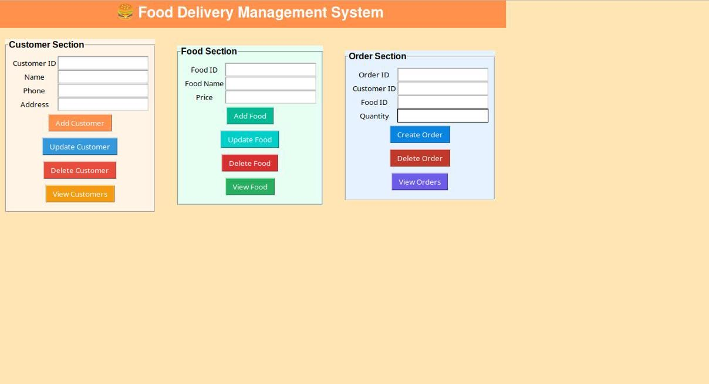
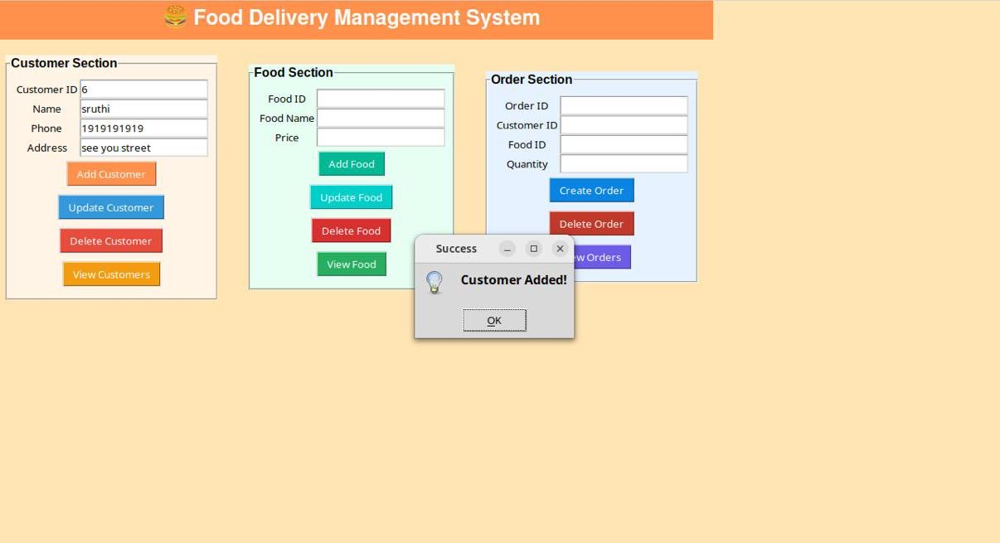
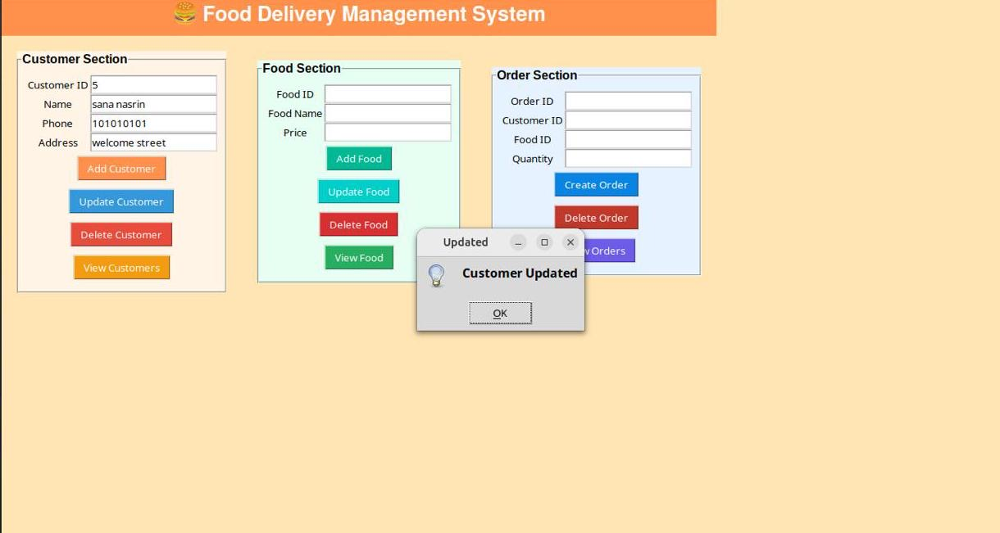
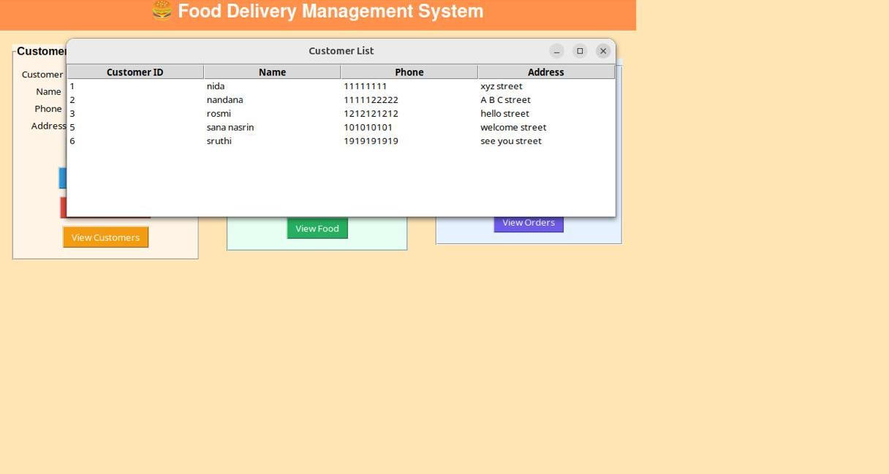
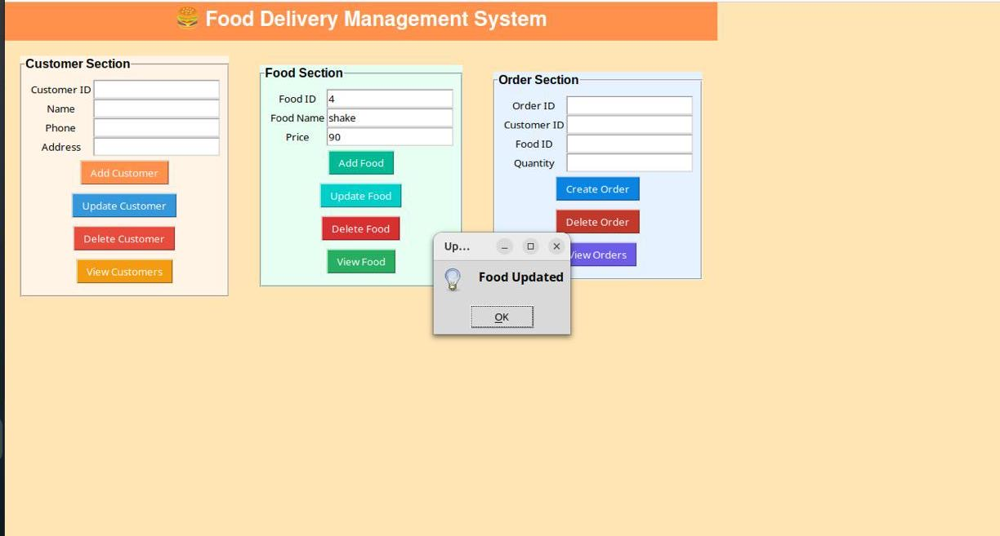
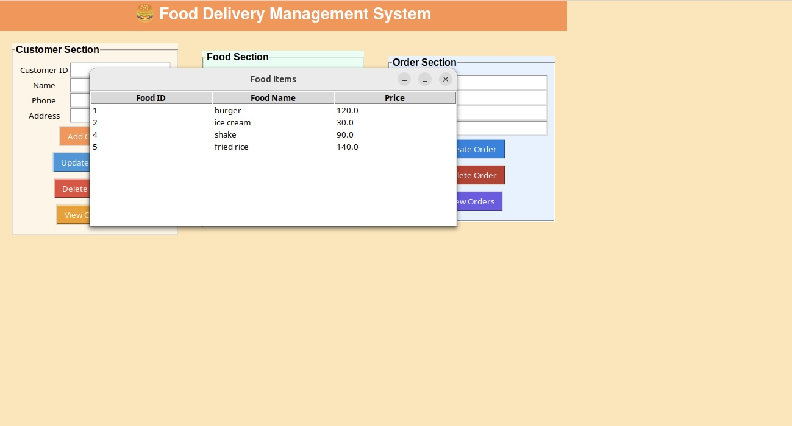
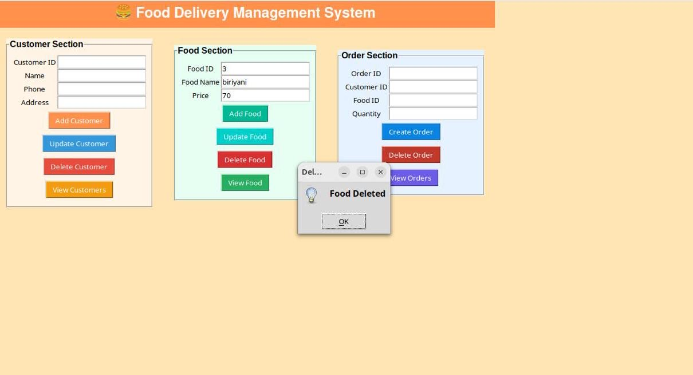
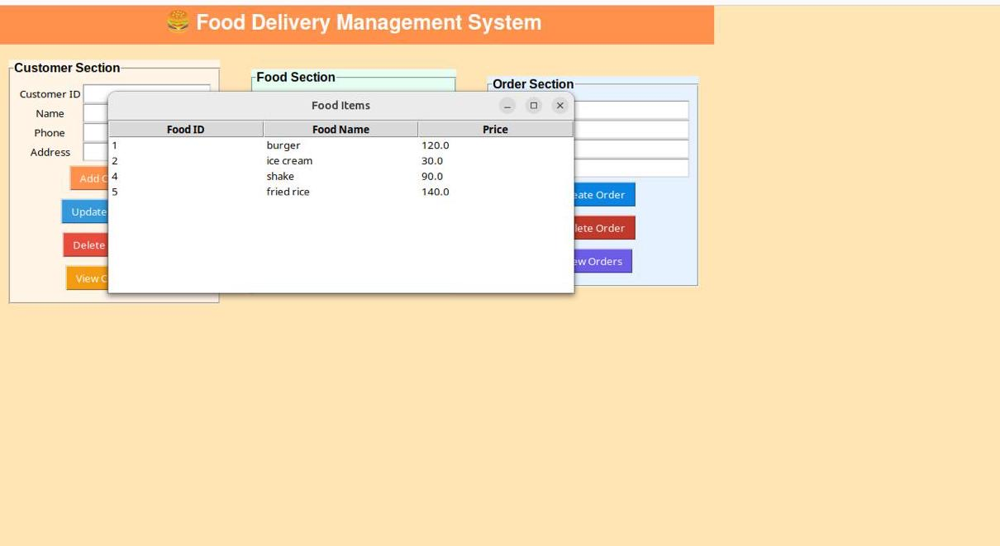
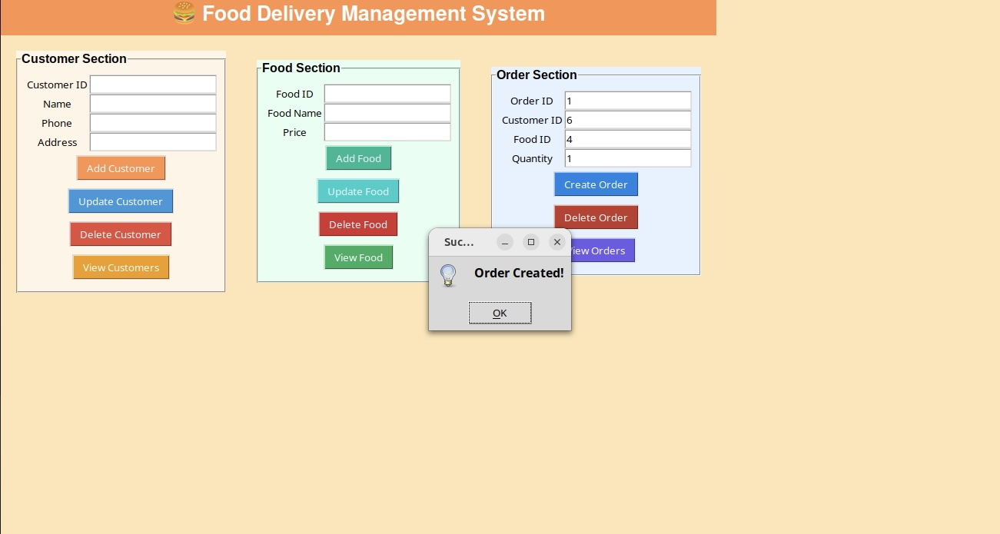
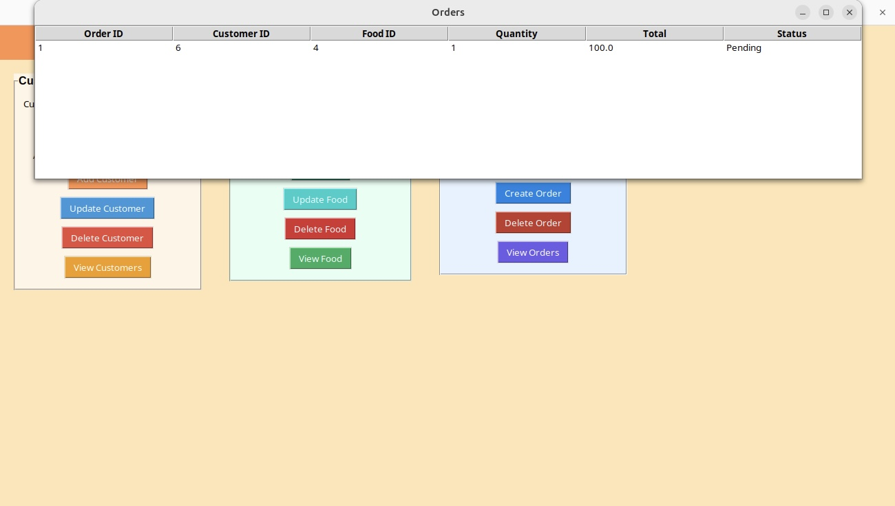

# Food Delivery Management System

## Description
This is a DBMS project built using Python, Tkinter, and MongoDB.
It allows users to manage customers, food items, and orders.

## Technologies
- Python
- Tkinter
- MongoDB
- PyMongo

## How to Run

1. Install Python
2. Install MongoDB
3. Install dependencies
   pip install -r requirements.txt
4. Run the program python main.py

## Screenshots

### Main Page

### Customer Management

### Food Management

### Order Management

---

## Project Report

Full documentation of the project:

[View Report](food_delivery_dbms_report.pdf)
